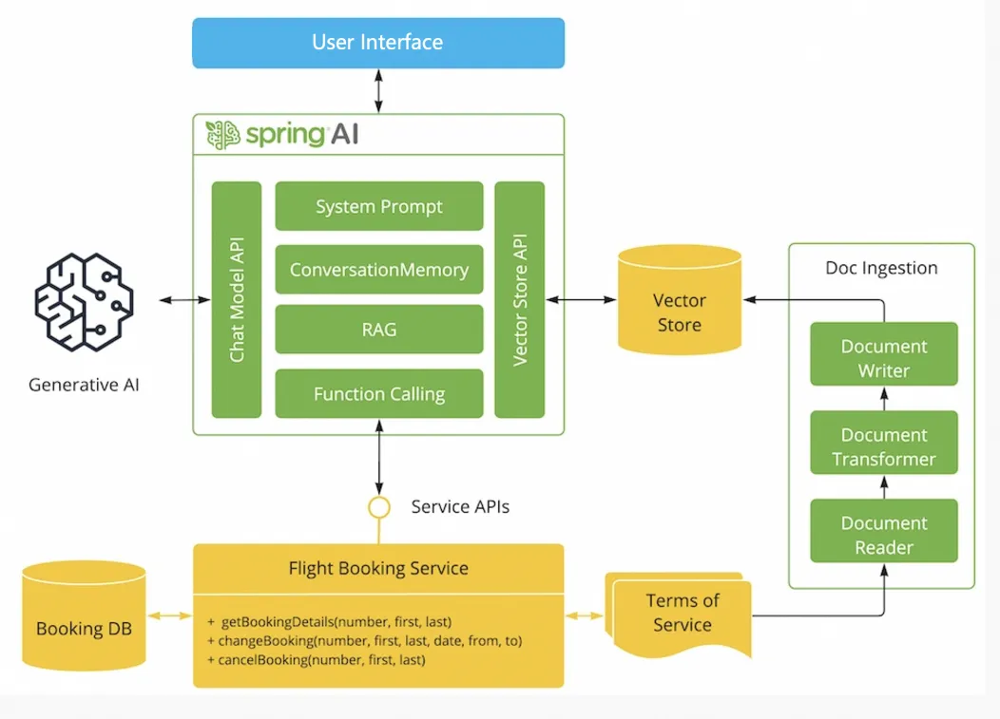

# 人工智能驱动的专家系统演示

此应用程序展示了您如何借助 Spring AI Alibaba 构建一个由人工智能驱动的系统，该系统具备以下功能：

- 具备获取条款和条件（检索增强生成，RAG）的能力
- 能够调用工具（Java 方法）来执行操作（函数调用）
- 利用大型语言模型与用户进行交互



## 要求

- Java 17+
- 在名为 `DASHSCOPE_API_KEY` 的环境变量中设置的 Dashscope API 密钥

## 运行

通过在您的集成开发环境（IDE）中运行 `Application.java` 或在命令行中运行 `mvn spring-boot:run` 来运行该应用程序。


添加依赖

```xml
<dependency>
    <groupId>org.springframework.ai</groupId>
    <artifactId>spring-ai-alibaba-starter</artifactId>
    <version>1.0.0-M6.1</version>
</dependency>
```

添加配置

```properties
spring.ai.dashscope.api-key=${AI_DASHSCOPE_API_KEY}
spring.ai.dashscope.chat.options.model=qwen-max
```

## Build Jar

```shell
./mvnw clean package
```

```shell
java -jar ./target/playground-flight-booking-example-0.0.1-SNAPSHOT.jar
```

## （根据需要）构建前端部分

运行以下命令来构建前端部分，只有在您对前端进行了修改的情况下才需要执行此操作。
```text
cd frontend
npm i
npm run dev
```
